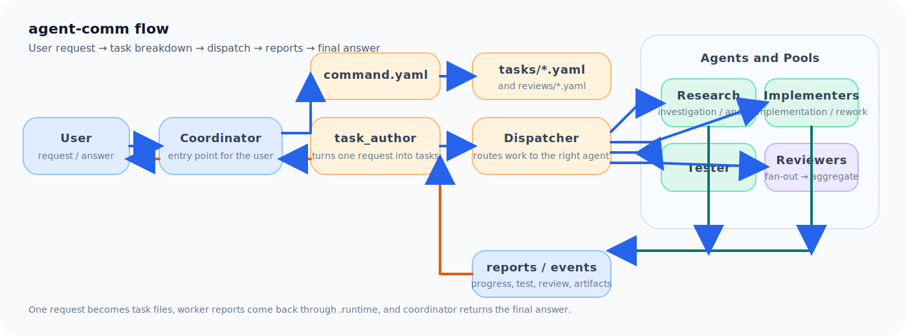
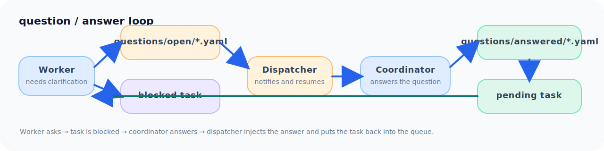
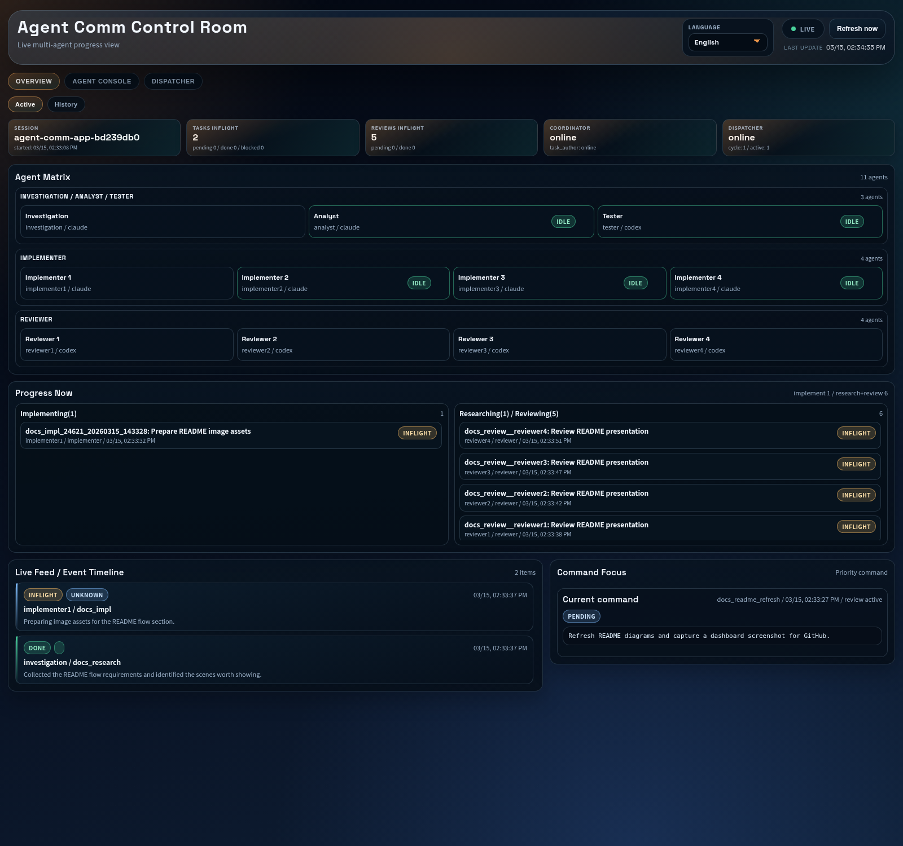

# agent-comm

[English](./README.md) | [日本語](./README.ja.md)

`agent-comm` は、Codex / Claude 混在構成に対応した bash-first なマルチエージェントランナーです。対象プロジェクト配下に clone し、`agent-comm.ini.example` と `agents.ini.example` をコピーして設定を編集してから `start` を実行すると、runtime ファイルをプロジェクトルートへ散らさずに tmux agents とローカル dashboard を起動できます。

## Quick Start

1. このリポジトリを `<project>/agent-comm` に clone します。
2. `agent-comm.ini.example` を `agent-comm.ini` にコピーします。
3. `agents.ini.example` を `agents.ini` にコピーします。
4. `agent-comm.ini` を編集します。
5. `agents.ini` を編集します。
6. 使う runtime(claude/codex) にログインします。
7. `bin/agent-comm start` を実行します。
8. `start` または `status` で表示された dashboard URL を開きます。

## Public Commands

- `bin/agent-comm validate-config`
- `bin/agent-comm start`
- `bin/agent-comm stop`
- `bin/agent-comm restart <coordinator|task_author|dispatcher|investigation|analyst|tester|implementers|reviewers|workers|implementerN|reviewerN|all>`
- `bin/agent-comm status`
- `bin/agent-comm dashboard [start|stop|status]`
- `bin/agent-comm send --agent <id> --message <text|file>`

## End-to-End Flow

全体像はこれです。



要点:

- `coordinator` がユーザー依頼を受けます。
- `task_author` が依頼を task file に分解します。
- dispatcher が task を対応 agent / pool に配布します。
- 調査、実装、テスト、レビューの結果は `.runtime/reports/events` に返ります。
- `task_author` がその結果を見て次 task か完了を決めます。
- 最後は `coordinator` がユーザーへ返答します。

質問と回答のループ:



要点:

- worker が安全に進められないとき質問を作ります。
- task は `blocked` に移動します。
- dispatcher が `coordinator` に質問を通知します。
- `coordinator` が回答します。
- dispatcher が回答を task に追記し、再配布します。

## Dashboard

Overview スクリーンショット:



## Runtime Layout

生成物はすべて `agent-comm/.runtime/` 配下に保存されます。

- `.runtime/commands`
- `.runtime/tasks`
- `.runtime/reviews`
- `.runtime/questions`
- `.runtime/events`
- `.runtime/reports`
- `.runtime/status`
- `.runtime/manual-prompts`
- `.runtime/research_results`

## Config

`agent-comm.ini` は共通 runtime 設定です。

| セクション | キー | 既定値 | 説明 |
| --- | --- | --- | --- |
| `runtime` | `agent_working_dir` | `../` | tmux pane と agent process の作業ディレクトリです。相対パスは `agent-comm.ini` 基準で解決されます。 |
| `runtime` | `language` | `en` | agent 向け初期指示、role 解決、dispatcher 通知の既定言語です。`ui.language` が空なら dashboard もこの値を使います。 |
| `runtime` | `codex_home` | `~/.codex` | Codex の設定と認証を置くディレクトリです。Claude は通常のユーザー認証を使います。 |
| `runtime` | `dangerously_bypass_approvals_and_sandbox` | `false` | runtime ごとの無承認起動フラグを有効にします。Codex では `--dangerously-bypass-approvals-and-sandbox`、Claude では `--dangerously-skip-permissions` を付与します。 |
| `tmux` | `session_name` | 空 | tmux session 名です。空なら repo path 由来の一意名を自動生成します。 |
| `ui` | `auto_start` | `true` | `start` 実行時に local dashboard を自動起動します。`false` でも `bin/agent-comm dashboard start` は使えます。 |
| `ui` | `port` | `43861` | local dashboard の待受ポートです。 |
| `ui` | `open_browser` | `false` | 起動後に OS 既定ブラウザで dashboard URL を開きます。 |
| `ui` | `language` | 空 | dashboard 専用 override です。空なら `runtime.language` を使います。翻訳がなければ `en`、さらに無ければ空文字へ fallback します。 |
| `roles` | `extra_paths` | 空 | 追加 role i18n root をカンマ区切りで指定します。各 path は `agent-comm.ini` 基準で解決され、`<path>/<lang>/...` を持つ前提です。 |

`agents.ini` は agent 構成です。

ルール:

- `runtime` は `codex` または `claude` を指定します。
- `model` は任意です。空なら `agent-comm` は `--model` を付けず、各 runtime CLI の既定 model を使います。
- `count` は `[implementer]` と `[reviewer]` にだけ使います。
- `investigation` / `analyst` / `tester` は単独 agent 固定です。
- `reviewer.count` は全体レビュー時の fan-out 数です。review task は reviewer 全員分の子 task に展開されます。

| セクション | キー | 説明 |
| --- | --- | --- |
| `[coordinator]` | `runtime`, `model` | ユーザー指示の受け口です。`model` が空なら runtime CLI の既定 model を使います。 |
| `[task_author]` | `runtime`, `model` | 調査・実装・テスト・レビュー task へ分解します。`model` が空なら runtime CLI の既定 model を使います。 |
| `[dispatcher]` | `runtime`, `model` | queue / snapshot loop の明示的な構成枠です。dispatcher 本体は bash process のまま動きます。`model` が空なら runtime CLI の既定 model を使います。 |
| `[investigation]` | `runtime`, `model` | `investigation` task 専任 agent です。`model` が空なら runtime CLI の既定 model を使います。 |
| `[analyst]` | `runtime`, `model` | `analyst` task 専任 agent です。`model` が空なら runtime CLI の既定 model を使います。 |
| `[tester]` | `runtime`, `model` | テスト実行専任 agent です。`model` が空なら runtime CLI の既定 model を使います。 |
| `[implementer]` | `runtime`, `model`, `count` | 実装 / rework 用 pool です。空いている implementer に配布されます。`model` が空なら runtime CLI の既定 model を使います。 |
| `[reviewer]` | `runtime`, `model`, `count` | 全体レビュー用 pool です。review task は reviewer 全員へ展開されます。`model` が空なら runtime CLI の既定 model を使います。 |

## Dispatch Rules

- `investigation` task は `investigation` に配布します。
- `analyst` task は `analyst` に配布します。
- `implementation` / `rework` task は `implementer` pool に配布します。
- tester 向け task は `tester` に配布します。
- review task は `reviewer` pool 全員に fan-out します。
- review 完了結果は 1 つの親 review 結果へ集約して `task_author` へ返します。

## Role Format

role ファイルは `roles/i18n/<lang>/` に置きます。
persona ファイルは `roles/i18n/<lang>/personas/` に置きます。

各 role ファイルは YAML frontmatter から始める必要があります。

```md
---
id: tester
kind: persona
label: Tester
lang: en
required: true
---
```

`kind` には `agent`、`persona`、`shared` のいずれかを指定します。
`lang` は必須です。
role は `target language -> en -> 利用可能な file` の順で解決します。

必須の標準 role は次のとおりです。

- `coordinator`
- `task_author`
- `worker`
- `common`
- `implementer`
- `tester`
- `reviewer`
- `investigation`
- `analyst`

## Dashboard API

- `GET /api/snapshot`
- `GET /api/tmux/snapshot`
- `POST /api/tmux/send`

dashboard server は local-only で、Python 標準ライブラリだけを使っています。

## Contributing

write 権限がない場合は、このリポジトリを fork し、fork 側で branch を作成してから `sargienest/agent-comm` に pull request を作成してください。

## License

MIT License です。詳細は [LICENSE](./LICENSE) を参照してください。
